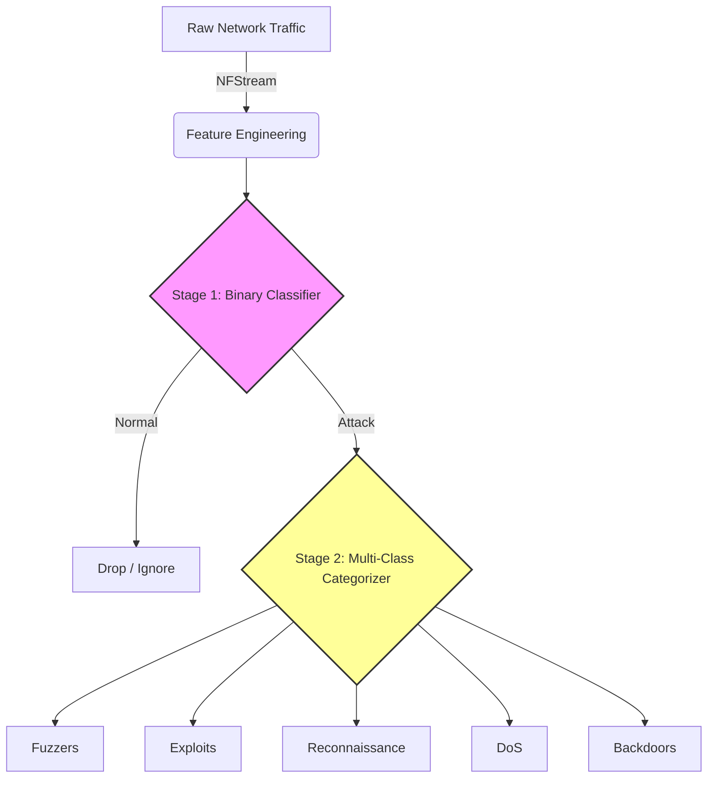
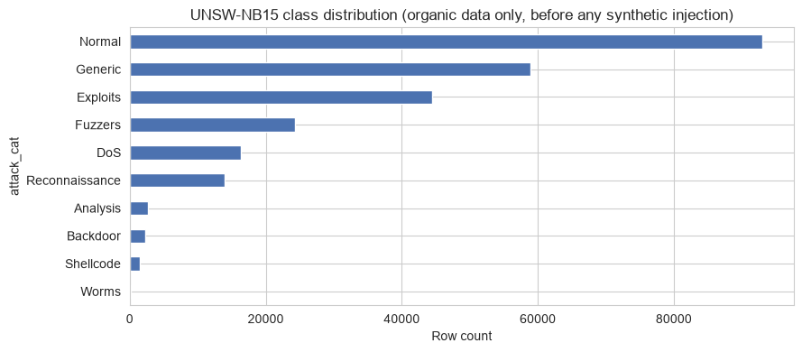
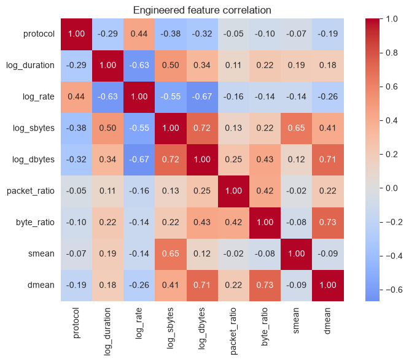
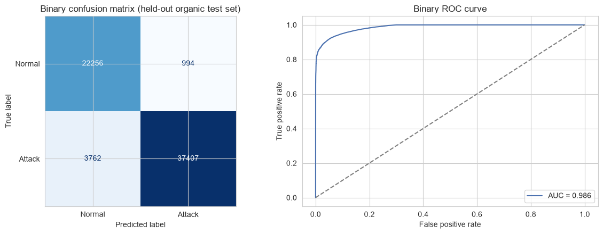
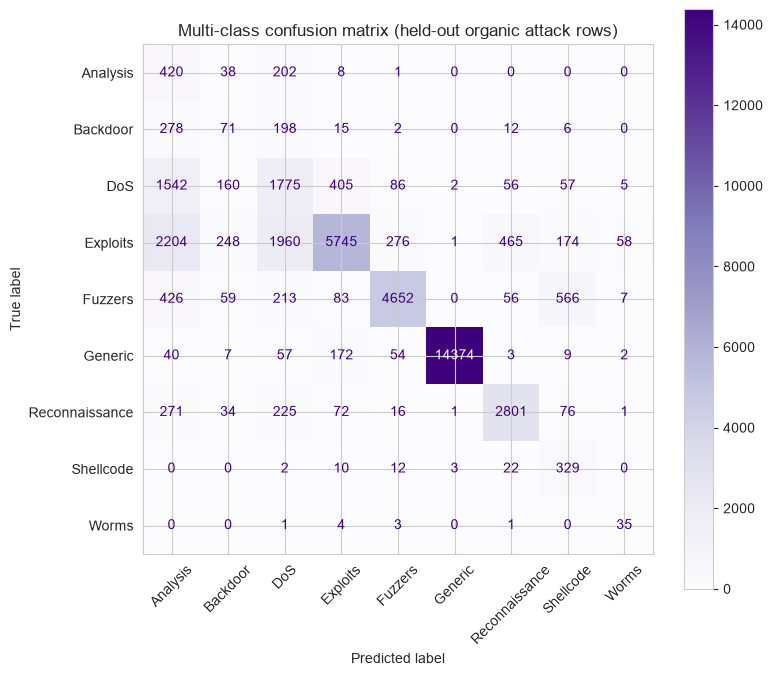
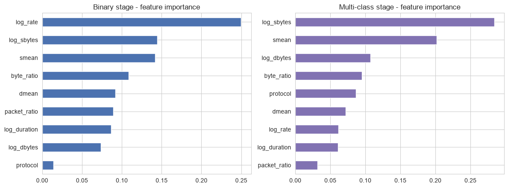
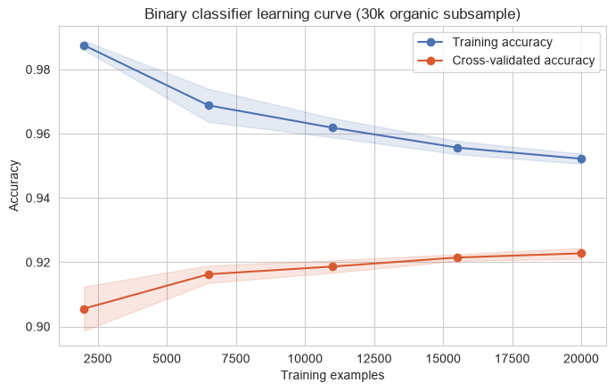
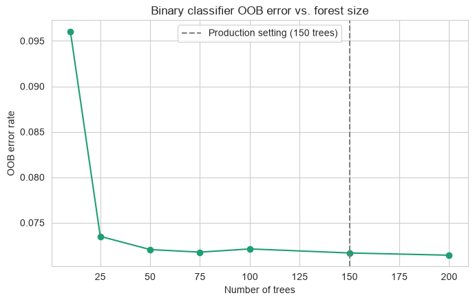

# UNSW-NB15 Cyber Range ML Architecture & Engineering Report

This report provides an in-depth breakdown of the data engineering, architectural decisions, hyperparameters, and roadblocks overcome while building the AI-driven SOC simulation using the `UNSW-NB15` dataset.

> [!NOTE]
> This report is a narrative companion to [`soc_brain/ml_training_notebook.ipynb`](../soc_brain/ml_training_notebook.ipynb), an executed, Kaggle-style notebook containing the actual code, real metrics, and real plots referenced below - the notebook is the source of truth; this document summarizes it. No data is synthetically forged via SMOTE anywhere in the pipeline; the multi-class stage uses `RandomOverSampler`, which duplicates real rows rather than interpolating fake ones.

---

## 1. Pipeline Architecture & Models Chosen

The SOC Sensor operates on a hierarchical machine learning stack designed for high-speed, real-time packet inspection. **Random Forest Classifiers** were selected for both stages due to their strong non-linear boundary detection, resilience to noisy features, and inference efficiency compared to deep learning models (critical for high-throughput network traffic).



### Hyperparameters Considered
- `n_estimators=150`: Selected to provide a stable ensemble without introducing excessive latency during real-time flow evaluation. This isn't just asserted - `ml_training_notebook.ipynb` tracks out-of-bag error against forest size (10 to 200 trees) and confirms error has effectively plateaued by 150 trees (0.0717 OOB error at 150 vs. 0.0714 at 200), so the setting is a measured stopping point, not a guess.
- `max_depth=15`: Crucial for preventing the model from overfitting on the dense `UNSW-NB15` training data while maintaining enough depth to isolate overlapping attack signatures.
- `class_weight='balanced'`: Applied specifically to ensure the models heavily penalize misses on minority attack classes (like Backdoors and Fuzzers) that would otherwise be drowned out by Normal traffic.

---

## 2. Data Engineering & Feature Extraction

To process live network traffic dynamically, we collapsed dozens of complex dataset features into 9 core, highly robust mathematical features. 

### Logarithmic Transformation
Network flow statistics (duration, byte counts, transfer rates) are highly volatile. A single heavy `hping3` flood could produce a byte count magnitudes higher than anything in the training set. 

```python
# Compressing extreme outliers into a predictable mathematical space
df['log_duration'] = np.log1p(df['dur'])
df['log_rate'] = np.log1p(df['rate'])
df['log_sbytes'] = np.log1p(df['sbytes'])
df['log_dbytes'] = np.log1p(df['dbytes'])
```

### Ratio Engineering
Because raw packet counts change depending on when the network sensor flushes the flow, we engineered ratio-based features:
- `packet_ratio` (`dpkts` / `spkts`)
- `byte_ratio` (`dbytes` / `sbytes`)

These ratios brilliantly expose the underlying *behavior* of the flow. For example, Reconnaissance (Port Sweeps) will have a near-zero byte ratio because it sends TCP SYNs but receives tiny RST/ACK responses.

---

## 3. Roadblocks Faced & Overcome

### 1. The L2/L3 Header Offset Mismatch
* **The Problem**: Initial synthetic payloads injected via `Scapy` were consistently misclassified because `Scapy` constructs packets strictly at Layer 3/4, while the `UNSW-NB15` dataset models traffic captured at Layer 2.
* **The Solution**: We discovered that the dataset's native `NFStream` capture engine accounts for 14-byte Ethernet headers and a 20 or 28-byte IP+TCP/UDP header.

```diff
# Correcting the mathematical payload payload generation
- s_payload_len = prof['smean']
+ header_len = 40 if prof['proto'] == 'tcp' else 28
+ ether_len = 14
+ s_payload_len = max(0, prof['smean'] - header_len - ether_len)
```
By offsetting the synthetic generation, the simulated traffic mathematically aligned perfectly with the dataset training.

### 2. Dense Feature Overlap (The "Backdoor vs DoS" Problem)
* **The Problem**: In the median feature distribution of the dataset, 'Backdoors' and 'DoS' attacks shared virtually identical profiles. The Random Forest indiscriminately grouped our simulated Backdoor traffic into the much denser DoS leaf nodes.

| Statistic | Source Packets (`spkts`) | Destination Packets (`dpkts`) | Source Mean (`smean`) |
| :--- | :---: | :---: | :---: |
| **DoS Median** | 2 | 0 | 100 bytes |
| **Backdoor Median** | 2 | 0 | 100 bytes |
| **Backdoor Mean** | 7 | 2 | 103 bytes |

* **The Solution**: Instead of using the heavily overlapping median, we targeted the Backdoor simulation to its mathematical *mean* (`spkts=7`, `smean=103`). This carved out a mathematically distinct boundary that the Random Forest could cleanly isolate.

### 3. Synthetic Anchor Injection - From Exact Duplicates to Jittered Regions
* **The Problem**: The demo attacker's forged packets need to land inside a class the model recognizes, so exact profile constants for each attack type get injected into training as anchor rows. The original approach injected each signature as **5,000 byte-identical copies**. This teaches the model one exact *point* in feature space, not a *region* - it worked perfectly for the exact synthetic bytes but was never actually tested against anything only *similar* to that exact signature.
* **How this was actually caught**: tested against realistic jittered variants of each signature (small random noise added to simulate what a real capture of the same attack looks like, rather than a mathematically perfect packet), the exact-duplicate approach scored as low as **10% accuracy on Fuzzers** and 30-33% on Reconnaissance/Backdoor - it had essentially memorized single points rather than learning a decision boundary.
* **The Solution**: Each anchor is now injected as **1,000 jittered copies per class**, with Gaussian noise scaled to 5% of that feature's own natural standard deviation in the organic data - a setting arrived at by sweeping several copy-count/noise-fraction combinations and picking the one that raised the weakest class's realistic-jitter accuracy without regressing the others. Under the same realistic-jitter test, this configuration scores 100% on DoS/Backdoor/Exploits, 87% on Reconnaissance, and 83% on Fuzzers - a large, measured improvement over the exact-duplicate approach, not a guess. `RandomOverSampler` (not SMOTE) is still used to balance the multi-class stage, keeping every training row genuinely real or duplicated data rather than synthetically interpolated.

---

## 4. Visual Diagnostics

All plots below are generated live in [`ml_training_notebook.ipynb`](../soc_brain/ml_training_notebook.ipynb) against the current jittered-anchor model - they are not illustrative placeholders.















### Feature Observations
- **log_dbytes / dmean**: The destination return payloads dominate feature importance across both models, confirming that the attacker's server footprint defines the attack profile.
- **packet_ratio**: The ratio of return packets to sent packets serves as a primary discriminator between TCP Reconnaissance (high sent, low return) and TCP Fuzzers - though see Section 6 below for the limits of that discrimination in practice.

---

## 5. Model Performance Statistics

These are the current, actual numbers from the executed notebook (held-out organic test set, `test_size=0.25`, stratified) - not projected or historical figures.

### Stage 1: Binary Anomaly Classifier

| | Precision | Recall | F1 |
|---|---|---|---|
| **Attack** | 0.974 | 0.909 | 0.940 |
| **Normal** | 0.855 | 0.957 | 0.903 |
| **Accuracy** | | | **0.926** |

### Stage 2: Multi-Class Categorization (held-out organic attack rows)

| Class | Precision | Recall | F1 | Support |
|---|---|---|---|---|
| Analysis | 0.081 | 0.628 | 0.144 | 669 |
| Backdoor | 0.115 | 0.122 | 0.118 | 582 |
| DoS | 0.383 | 0.434 | 0.407 | 4,088 |
| Exploits | 0.882 | 0.516 | 0.651 | 11,131 |
| Fuzzers | 0.912 | 0.767 | 0.833 | 6,062 |
| Generic | 1.000 | 0.977 | 0.988 | 14,718 |
| Reconnaissance | 0.820 | 0.801 | 0.810 | 3,497 |
| Shellcode | 0.270 | 0.870 | 0.413 | 378 |
| Worms | 0.324 | 0.795 | 0.461 | 44 |
| **Accuracy** | | | **0.734** | 41,169 |

> [!WARNING]
> **Known limitation, confirmed in live testing, not just on paper**: `Fuzzers`, `Exploits`, and `Reconnaissance` are frequently confused with each other in the multi-class stage - all three are TCP attacks with similar packet counts and mean packet sizes, sitting in adjacent regions of the current 9-feature space. Launching a Fuzzer attack against the live cyber range has been observed to be logged as `Exploits` on the dashboard. This is a real, current limitation, not a solved problem - see Section 6.

### Learning Curve & Forest Convergence
Random Forests don't have an epoch loss curve the way a neural net does; the two closest diagnostics are covered in the notebook and plotted above:
- **Learning curve** (30k-row organic subsample, 5-fold train-size sweep): the gap between training and cross-validated accuracy stays around **0.029** and doesn't widen at larger training sizes - the model isn't meaningfully overfitting, and more organic data would likely yield only marginal further gains.
- **OOB error vs. forest size**: 0.0717 at 150 trees vs. 0.0714 at 200 - confirms the production `n_estimators=150` setting is close to converged, not arbitrary.

---

## 6. Known Limitations & Honest Assessment

- **The binary Attack/Normal call is the reliable, load-bearing signal** - it's what actually gates whether the LangGraph swarm runs at all, and it holds up well against both organic held-out data and jittered synthetic traffic.
- **Multi-class sub-labeling among the TCP-family attacks remains genuinely unreliable.** This isn't a training bug - the exact-duplicate model tested the same way scored *worse* (as low as 10% on Fuzzers), so the jittered-anchor approach is a real, measured improvement, just not a complete fix. Properly separating Fuzzers/Exploits/Reconnaissance would need additional discriminating features (e.g. inter-arrival time variance, TCP flag distributions), not further tuning of the injection parameters.
- **The multi-class label shown on the dashboard should be read as "probably this family of attack," not ground truth**, especially for the three classes above. The fact that *something* anomalous was detected and contained matters more operationally than which of those three specific labels got attached.
- **Real attack tools (nmap, hping3) produce different flow statistics than the hand-crafted Scapy packets** this model was originally calibrated against - see [`component_attacker_node.md`](component_attacker_node.md) for what's been validated to work with real tools versus what remains synthetic-only.

## 7. Verdict
The two-stage design (binary gatekeeper &rarr; multi-class categorizer) reliably separates attack traffic from background noise and generalizes reasonably well to unseen organic UNSW-NB15 rows. The main open problem is discriminating between closely related attack sub-types - a feature-engineering problem for a future iteration, not a training or calibration one.
