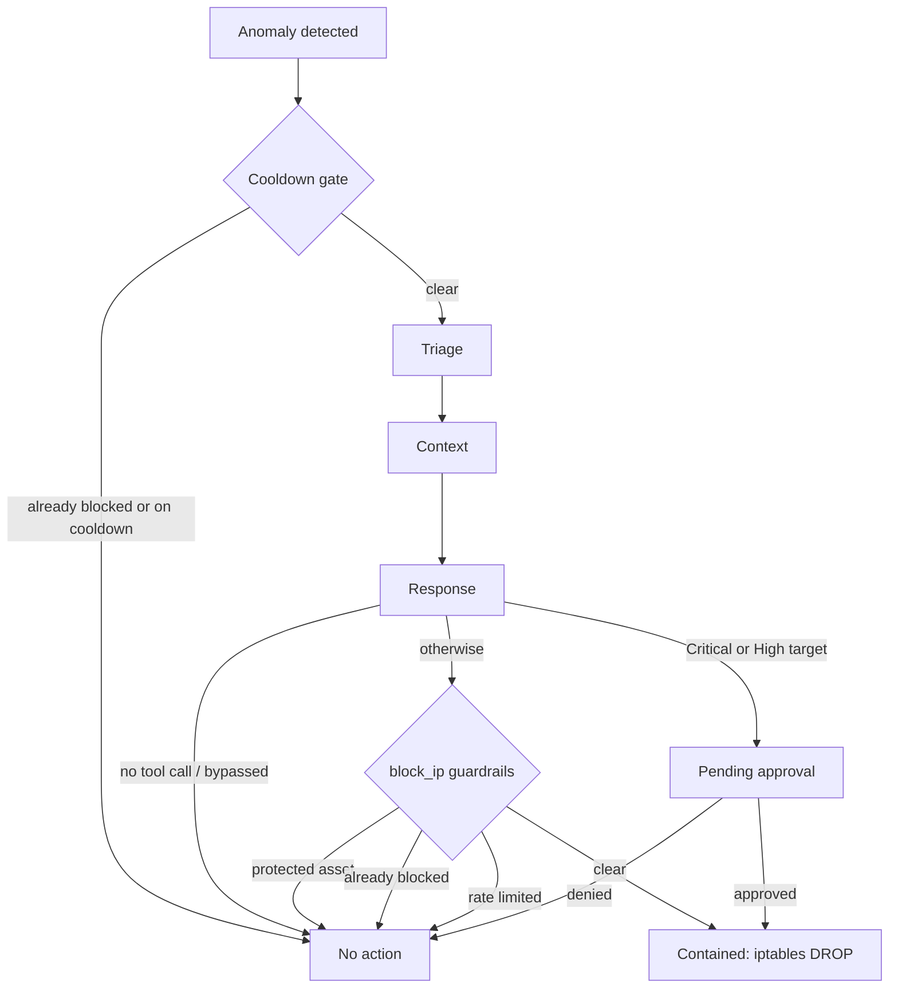

# Triage & Resolution Flows

This document walks through every path an alert can take from the moment traffic is flagged to the moment it's either contained, deferred, or dismissed. It reflects the current state of `orchestrator.py` and `live_sensor.py`, including the guardrails (allow-list, rate limiting, tiered approval, block expiry) added on top of the original detection pipeline.

## 1. Two detection entry points

Both live in `live_sensor.py` and both end the same way: by calling `trigger_swarm(alert_data)`.

- **ML classifier path** — every captured flow is scored by the binary Random Forest model. If it predicts `Attack` with confidence ≥ 0.55, the multi-class model assigns a sub-label (`DoS`, `Fuzzers`, `Exploits`, `Backdoor`, `Reconnaissance`) and an alert fires.
- **Port-scan correlator path** — runs only on flows the ML model already called `Normal`. It tracks distinct `(dst_ip, dst_port)` pairs touched by each source IP inside a 5-second rolling window; 5 or more distinct targets from small (≤4-packet) flows fires a synthetic `Reconnaissance` alert directly. This exists because a real port scan is many separate 1-2 packet flows, each individually indistinguishable from an ordinary short connection - the scan signature only exists *across* flows, not within any single one, so the per-flow ML model can't see it on its own.

## 2. The gate, before anything else runs

Inside `trigger_swarm`, two checks can end the request before the LangGraph pipeline even starts:

1. **Already blocked** - if the source IP is in `blocked_ips`, skip entirely and log.
2. **Per-source cooldown** - if under 30 seconds have passed since this *specific* source IP last ran through the pipeline, skip. This is deliberately per-source rather than global, so one attacker's cooldown never hides a detection for a different, unrelated attacker.

Only after both checks pass does `app_graph.invoke(...)` run the three-node pipeline.

## 3. The pipeline: Triage → Context → Response

Each node has a **dry-run branch** and a **real-LLM branch**, selected globally by the `LLM_DRY_RUN` environment variable (defaults to `True` so testing doesn't burn API quota).

### Triage
- **Dry-run**: builds a canned markdown summary directly from the alert's fields (source, destination, protocol, bytes, ML confidence).
- **Real**: a single `llm.invoke()` call asks Gemini to produce the same style of report from the raw alert JSON.
- **On LLM error**: falls back to a canned `[LLM ERROR]` message rather than crashing the pipeline.

### Context
- **Dry-run**: calls `lookup_asset()` directly against the asset registry and formats the result.
- **Real**: a `create_react_agent` bound to `lookup_asset_tool` - the model itself decides to call the registry lookup, rather than Python fetching it beforehand and handing it over. The prompt is deliberately neutral about whether containment is warranted; that decision belongs to the next stage.
- **On LLM error**: same canned fallback pattern as Triage.

### Response
This is where all the branching lives.

1. Look up `target_criticality` from the alert's destination IP and set `requires_approval = criticality in {Critical, High}`.
2. **Dry-run**:
   - `requires_approval` → `request_approval()` (queued, no action taken yet).
   - otherwise → `block_ip()` directly.
3. **Real**: a fresh `block_ip_tool` is built per-call via `make_block_ip_tool()`, closure-bound to this alert's data (not a shared global tool - LangGraph's `ToolNode` can execute tool calls on a different thread than the caller, so a closure is used instead of thread-local storage, which would silently lose the alert context). The agent is asked to decide whether to call it. Three outcomes:
   - **Agent calls the tool** → `_decide_and_contain()` re-checks `requires_approval` and either queues approval or calls `block_ip()`.
   - **Agent doesn't call the tool** → status `Bypassed`, no action taken.
   - **LLM raises an exception** → fail-safe: still respects `requires_approval` if it applies, otherwise force-blocks. The system fails *closed*, not open.

## 4. Inside `block_ip()` - the actual containment gate

Every path above that decides to contain something funnels through the same function, which checks these in order - any one of them can end the request without ever touching `iptables`:

1. **Protected allow-list** - the sensor's own gateway addresses plus every IP in the asset registry. Refuses outright and logs a `REFUSED` mitigation. (This list exists because a flow captured independently on `eth0` vs `eth1` can come back with source and destination reversed, which has been observed in practice to make the agent try to block a registered internal asset instead of the real attacker.)
2. **Already blocked** - no-op, returns an informational message.
3. **Rate limit** - a rolling 60-second window capped at `MAX_BLOCKS_PER_WINDOW` (default 20, env-configurable). Over the cap → refuses and logs `RATE_LIMITED` for manual review, so a false-positive storm or a spoofed volumetric attack can't autonomously blackhole large parts of the network.
4. Only after all three checks pass does it run `iptables -A FORWARD -s <ip> -j DROP`, and on success records a `blocked_at` / `expires_at` (1-hour TTL by default) against the IP.

## 5. What happens after resolution

- **TTL expiry**: a daemon thread sweeps every 30 seconds and calls `unblock_ip()` on anything past its `expires_at`, so containment isn't permanent-until-full-reset.
- **Human review of a pending approval**: `POST /api/approve` → `approve_pending()` → calls `block_ip()` for real. `POST /api/deny` → `deny_pending()` → discards the pending entry and logs a `DENIED` mitigation without ever touching `iptables`.
- **Manual admin action** (the dashboard's "Trigger" button): `POST /api/trigger` calls the *same* `block_ip()` directly - no LangGraph, no Triage/Context stages - but it's still subject to the allow-list and rate limit.
- **Manual unblock**: `POST /api/unblock` calls `unblock_ip()` directly.

## Flow diagram

## Key takeaway

No matter which path an alert takes - ML classification or port-scan correlation, dry-run or real LLM, agent tool-call or manual admin action - they all converge on the same `block_ip()` / `request_approval()` pair. That's the single choke point where the allow-list, rate limit, and tiered-approval logic actually live, so none of those guardrails can be bypassed by taking a different route through the code.
